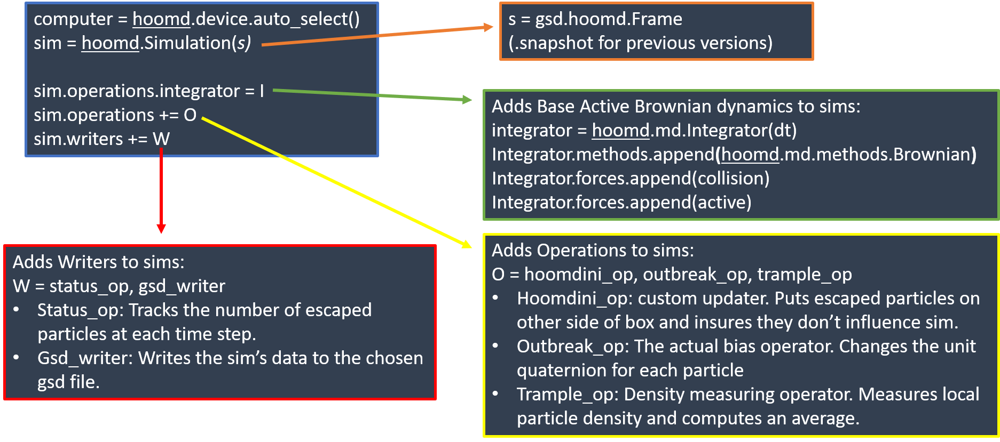

# hoomdini
HOOMD3 simulations of escape panic in a 2D box.

##Part 1: Code file:
### Cabilities of the code contained within this repository: 
- Varied particle types
  - Purely Brownian Particles 
  - Active Brownian Particles
  - Active Brownian with Bias towards exit 
- Customizable particle starting locations based on density for both square and hexagonal packing
- Placement of static particles to be used as either doors or obstacle 
- Exclusion of particles that have escaped through the walls
- Tracks the number of escaped particles over time and saves into a .csv 
- Tracks the avergae local density of active particles over time and saves to a .csv

### WIPs:
- The density tracker currently requires a large amount of memory. Other density trackers are possible, but the simulations take longer to run
- The hexagonal packing module is only set up for the highest density. Further work needs to be preformed to make it variable
- I worked on creating a vision based bias for module which is about 80% complete but needs further work
- For now the bias operator uses a for loop which is discuraged for the HOOMD custom operators due to time it takes to run. Needs optimization.

# Code Structure
I have attempted to keep my code heavily commented and have included a quick break down of the structure. 

### Breakdown of Modules:
- hoomdini: (Exclusion Updater) Once the particle leaves the exit(x>0), it moves the particle to the far side of the box(x=22), and changes its type ID
- particlePlacer: (Square packing Function) Places particles using square packing.
- placer: (Hexagonal packing function) Places particles using hexagonal packing.
- rereorient: (Bias Updater) Adds bias towards the door by changing each particle's orientation.
- reorient: (Bias Updater) Attempts to modify the bias updater to include assymetric vision and a lower depth of vision(WIP). 
- trampling: (Trampling Updater) Finds local density using freud.locality.Voronoi() and tracks high density regions, and average local density per time step.

### Diagram:

## Part 2: Processing File:

### Plotting Help

This is example python code for processing the outputted CSV files using Pandas and matplotlib. Examples on how to make both scatter plots and heat maps from the data. 

### Video state

This is the session state I was using with ovito. Load this file along with a run___.gsd file into the ovito app, and you can create videos I was using. 
